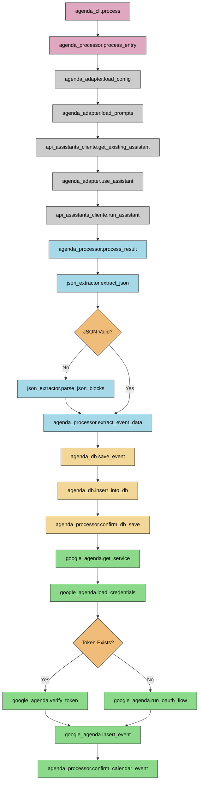

# Agenda Processing Flow Diagram

## Component Descriptions

### Main CLI Components
- **agenda_cli.process**: Entry point for the agenda processing
- **agenda_processor.process_entry**: Processes the agenda text entry

### OpenAI Assistant Integration
- **agenda_adapter.load_config**: Loads agenda assistant configuration
- **agenda_adapter.load_prompts**: Loads prompt templates from YAML file
- **api_assistants_cliente.get_existing_assistant**: Retrieves existing OpenAI assistant
- **agenda_adapter.use_assistant**: Sets up the assistant for use
- **api_assistants_cliente.run_assistant**: Runs the assistant with the agenda text

### JSON Processing
- **json_extractor.extract_json**: Attempts to extract JSON directly
- **json_extractor.parse_json_blocks**: Parses JSON from code blocks if direct parsing fails
- **agenda_processor.extract_event_data**: Extracts structured event data from the JSON

### Database Operations
- **agenda_db.save_event**: Prepares event data for database storage
- **agenda_db.insert_into_db**: Inserts the event into the database
- **agenda_processor.confirm_db_save**: Confirms successful database storage

### Google Calendar Integration
- **google_agenda.get_service**: Gets the Google Calendar service
- **google_agenda.load_credentials**: Loads Google API credentials
- **google_agenda.verify_token**: Verifies and refreshes the token if needed
- **google_agenda.run_oauth_flow**: Runs OAuth flow for new authentication if needed
- **google_agenda.insert_event**: Inserts the event into Google Calendar
- **agenda_processor.confirm_calendar_event**: Confirms calendar event creation

### Flow Summary
1. The agenda text is processed by the agenda processor
2. The OpenAI assistant is used to interpret the text into structured event data
3. JSON extraction is performed to get the event details
4. The event is saved to the database
5. The event is integrated with Google Calendar for external access
6. Success confirmation is returned to the user 