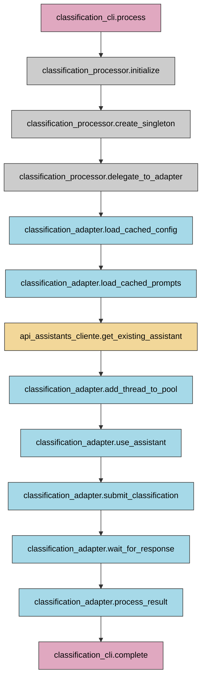

# Classification Flow Diagram

## Component Descriptions

### Main CLI Components
- **classification_cli.process**: Entry point for the classification process
- **classification_cli.complete**: Final confirmation of successful classification

### Processor Components
- **classification_processor.initialize**: Initializes the classification processor
- **classification_processor.create_singleton**: Creates singleton instance of processor
- **classification_processor.delegate_to_adapter**: Delegates classification to adapter

### Adapter Configuration
- **classification_adapter.load_cached_config**: Loads cached configuration
- **classification_adapter.load_cached_prompts**: Loads prompts from YAML file

### OpenAI Assistant Integration
- **api_assistants_cliente.get_existing_assistant**: Gets existing OpenAI assistant
- **classification_adapter.add_thread_to_pool**: Adds thread to pool for assistant
- **classification_adapter.use_assistant**: Uses assistant with specified thread

### Processing Components
- **classification_adapter.submit_classification**: Submits content for classification
- **classification_adapter.wait_for_response**: Waits for assistant's response
- **classification_adapter.process_result**: Processes classification result

### Flow Summary
1. The classification CLI initiates the process
2. A ClassificationProcessor is initialized as a singleton
3. The processor delegates to a classification adapter
4. The adapter loads cached configuration and prompts
5. An existing OpenAI assistant is used for processing
6. A thread is added to the pool for the assistant
7. The classification is submitted and the response is processed
8. The classification results are returned to the CLI 