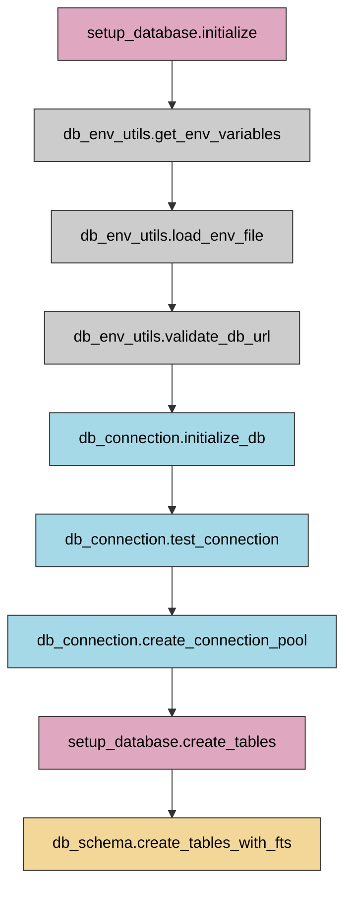

# Database Utilities Flow Diagram

## Component Descriptions

### Database Setup
- **setup_database.initialize**: Entry point for database initialization
- **setup_database.create_tables**: Triggers creation of database tables

### Environment Handling
- **db_env_utils.get_env_variables**: Retrieves environment variables from system
- **db_env_utils.load_env_file**: Loads variables from .env file
- **db_env_utils.validate_db_url**: Validates the database connection URL

### Database Connection
- **db_connection.initialize_db**: Initializes database connection
- **db_connection.test_connection**: Tests direct connection to PostgreSQL
- **db_connection.create_connection_pool**: Creates a connection pool for efficiency

### Schema Management
- **db_schema.create_tables_with_fts**: Creates all database tables with Full Text Search capability

### Flow Summary
1. Environment variables are loaded and validated
2. Database connection is established and tested
3. Connection pool is created for efficient database access
4. Database tables are created with Full Text Search support 