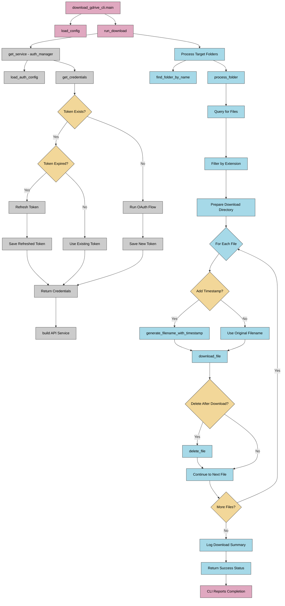

# Google Drive Download Flow Diagram

## Component Descriptions

### Main CLI Components
- **download_gdrive_cli.main**: Entry point for the download from Google Drive CLI
- **load_config**: Loads configuration from download_gdrive_config.json
- **run_download**: Main function that orchestrates the download process

### Authentication Components
- **get_service**: Creates authenticated API service
- **load_auth_config**: Loads authentication configuration
- **get_credentials**: Retrieves or refreshes Google API credentials
- **OAuth Flow**: User authentication if needed

### Download Process
- **find_folder_by_name**: Locates target Google Drive folders
- **process_folder**: Processes files in a specific folder
- **download_file**: Downloads individual files from Google Drive
- **delete_file**: Optionally deletes files after download
- **generate_filename_with_timestamp**: Adds timestamps to filenames

### File Processing
- Files are filtered based on configured file extensions
- Timestamps can be added to filenames during download
- Files can be optionally deleted from Google Drive after download 