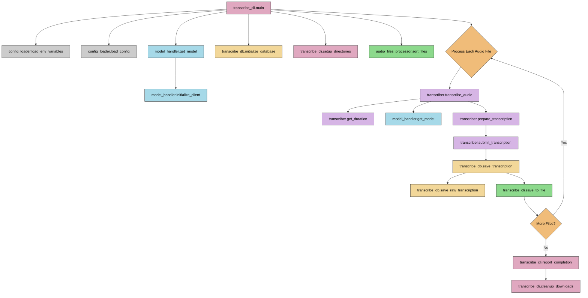

# Transcription Flow Diagram

## Component Descriptions

### Main CLI Components
- **transcribe_cli.main**: Entry point for the transcription CLI
- **transcribe_cli.setup_directories**: Sets up download and output directories
- **transcribe_cli.save_to_file**: Saves transcription to text file
- **transcribe_cli.report_completion**: Reports on completed transcriptions
- **transcribe_cli.cleanup_downloads**: Cleans up processed audio files

### Configuration
- **config_loader.load_env_variables**: Loads environment variables
- **config_loader.load_config**: Loads transcription configuration

### Model Handling
- **model_handler.get_model**: Fetches transcription model from config
- **model_handler.initialize_client**: Initializes OpenAI client

### Database Operations
- **transcribe_db.create_tables**: Creates database tables
- **transcribe_db.initialize_database**: Initializes database
- **transcribe_db.save_transcription**: Saves transcription to database
- **transcribe_db.save_raw_transcription**: Saves raw transcription data

### File Processing
- **audio_files_processor.sort_files**: Sorts audio files by timestamp
- **transcriber.get_duration**: Gets audio file duration

### Transcription Process
- **transcriber.transcribe_audio**: Main transcription function
- **transcriber.prepare_transcription**: Prepares transcription request
- **transcriber.submit_transcription**: Submits transcription to API

### Flow Summary
1. Configuration is loaded from files and environment
2. Model is initialized for transcription
3. Database is set up to store transcriptions
4. Audio files are processed one by one
5. Transcriptions are saved to database and files
6. Processed files are cleaned up after completion 